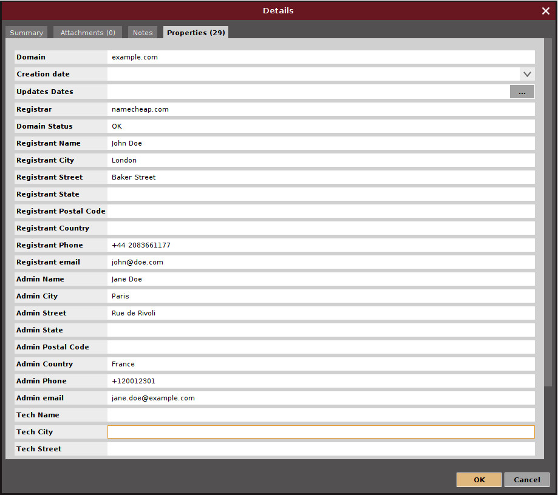
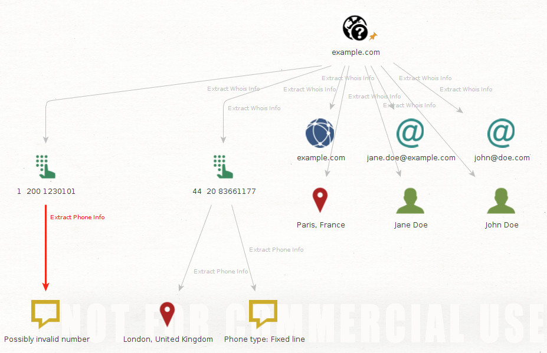

# Maltego utils

This are some transforms I made using the
[canari framework](https://github.com/redcanari/canari3) for Python 2.

I'm no expert (this is the first time a write a transform), so it's very likely that
there are some errors (in which case, you're welcome to contribute) or that the
transforms are not useful at all (note that I'm using the Community Edition, so a lot of
paid features aren't available to me).

I hope that this is useful for you. If it isn't, feel free to contribute or propose
fixes.

# Build and import on Maltego

As stated on the
[canari docs](https://canari3.readthedocs.io/en/latest/canari.quickstart.html), to build
the _.mtz_ file (the one that will be imported on Maltego), you just have to run the
following command from the _src/_ directory:
```
src/ $ canari create-profile utils
Looking for transforms in utils...
Package loaded.
Creating profile /.../utils/src/utils.mtz...
Installing transform utils.ExtractPhoneInfo from utils.transforms.extractphoneinfo.ExtractPhoneInfo...
Installing transform utils.ExtractWhoisInfo from utils.transforms.extractwhoisinfo.ExtractWhoisInfo...
Installing entity custom.WHOISregister to Entities/custom.WHOISregister.entity...
Installing custom icon Icons/PT/whois.png to Icons/PT/whois.png...
Installing custom icon Icons/PT/whois24.png to Icons/PT/whois24.png...
Installing custom icon Icons/PT/whois32.png to Icons/PT/whois32.png...
Installing custom icon Icons/PT/whois48.png to Icons/PT/whois48.png...
Writing fresh copy of canari.conf to '/.../utils/src/canari.conf'...
Writing transform set Utils to /.../utils/src/utils.mtz...
Writing server Local to /.../utils/src/utils.mtz

%%%%%%%%%%%%%%%%%%%%%%%%%%% SUCCESS! %%%%%%%%%%%%%%%%%%%%%%%%%%%

 Successfully created /.../utils/src/utils.mtz. You may now import this file into
 Maltego.

 INSTRUCTIONS:
 -------------
 1. Open Maltego.
 2. Click on the home button (Maltego icon, top-left corner).
 3. Click on 'Import'.
 4. Click on 'Import Configuration'.
 5. Follow prompts.
 6. Enjoy!

%%%%%%%%%%%%%%%%%%%%%%%%%%% SUCCESS! %%%%%%%%%%%%%%%%%%%%%%%%%%%
```

Follow the instructions and you're ready to go.


# Available entities

Only a new entity is available, used to logically group the information gathered from
a WHOIS query, as opposed to the default _pt.whois*_ entities, where there's an entity
for each possible field, difficulting (well... not so much; but it's not comfortable to
extract data from them by hand) the task of correlating data.



# Available transforms

This information can also viewed using _canari_:
```
$ canari list-transforms utils
Looking for transforms in utils...
Package loaded.
`- utils.ExtractPhoneInfo: Extracts all information available from the phone number (carrier, country...)
  `- Maltego identifiers:
    `- utils.ExtractPhoneInfo applies to maltego.PhoneNumber in set Utils

`- utils.ExtractWhoisInfo: Extracts all the information available on the input WHOIS register, creating all relevant entities from it (phone, location, persons...)
  `- Maltego identifiers:
    `- utils.ExtractWhoisInfo applies to custom.WHOISregister in set Utils
```

## Extract WHOIS Info

Takes the information held on a WHOISregister and creates all entities possible with the
information that can be deduced from the provided one.

This is the entities generated after running this transform on the previous WHOISregister
example:


## Extract Phone Info

This entity takes the standard PoneNumber entity, trying to extract all possible
information deduce from the number, using the library
[phonenumbers](https://github.com/daviddrysdale/python-phonenumbers).

This transform produces phrases an locations (when possible) with the carrier name, the
country, and other information that could be deduced from the number.

Following with the same example, this is the result of running transform on the two
extracted phone numbers:



# Dependencies

All Python dependencies are listed on the `requirements.txt` file, and can be installed
using `pip install -r requirements.txt` **(on Python 2, as canari doesn't support
Python 3)**
